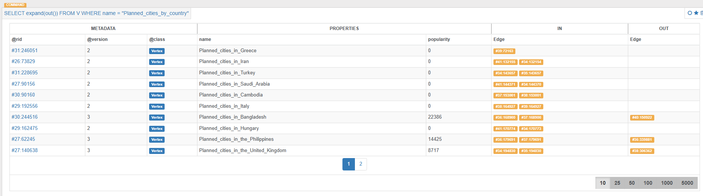
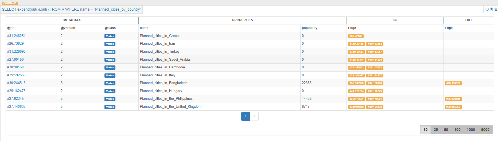
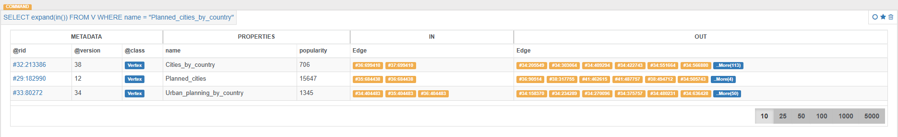
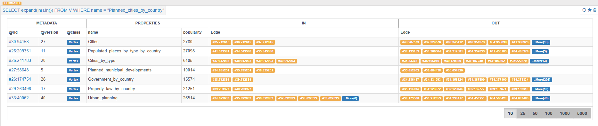
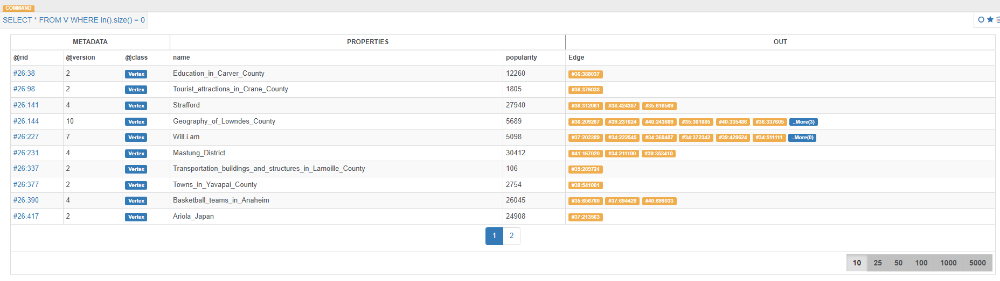
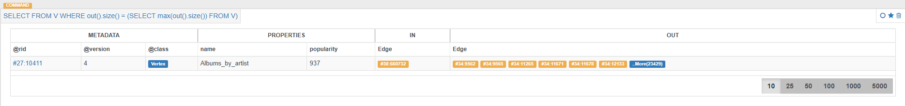
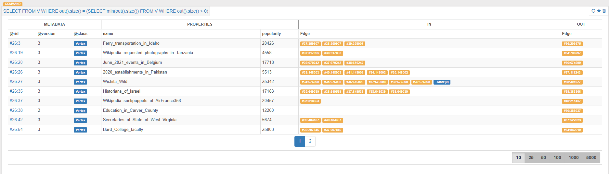
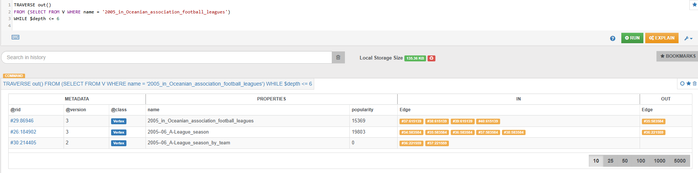
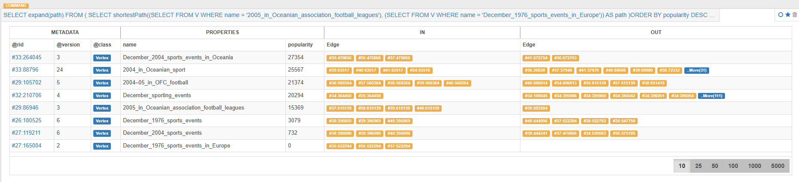

# Raport Technologiczny: System Importu Danych do Bazy OrientDB

*Data: (dzisiejsza data)*

---

## Spis Treści

- [Wybór Technologii](#wybór-technologii)
- [Architektura Systemu: Komponenty i Interakcje](#architektura-systemu-komponenty-i-interakcje)
    - [OrientDB](#orientdb)
    - [Aplikacja (`app`)](#aplikacja-app)
    - [Importer](#importer)
    - [Sieć (`app-network`)](#sieć-app-network)
- [Wymagania i Zależności](#wymagania-i-zależności)
    - [Zależności Projektowe](#zależności-projektowe)
- [Instrukcje Obsługi](#instrukcje-obsługi)
    - [Przygotowanie Środowiska](#przygotowanie-środowiska)
    - [Używanie Narzędzia `dbcli`](#używanie-narzędzia-dbcli)
    - [Zarządzanie Kontenerami](#zarządzanie-kontenerami)
- [Proces Projektowania i Wdrażania](#proces-projektowania-i-wdrażania)
    - [Projektowanie](#projektowanie)
    - [Wdrażanie](#wdrażanie)
- [Role w Projekcie](#role-w-projekcie)
- [Wyniki](#wyniki)
- [Efektywność Bazy OrientDB](#efektywność-bazy-orientdb)
    - [Zasobożerność](#zasobożerność)
    - [Trudności z Importem Danych](#trudności-z-importem-danych)
    - [Dokumentacja](#dokumentacja)
- [Strategie Łagodzenia Zidentyfikowanych Niedociągnięć](#strategie-łagodzenia-zidentyfikowanych-niedociągnięć)
    - [Optymalizacja Zasobów](#optymalizacja-zasobów)
    - [Usprawnienie Procesu Importu](#usprawnienie-procesu-importu)
    - [Poprawa Dokumentacji](#poprawa-dokumentacji)
- [Podsumowanie](#podsumowanie)

---

## Wybór Technologii

W projekcie zdecydowano się na wykorzystanie następujących technologii:

- **OrientDB**: Wybór tej bazy danych został podyktowany jej możliwościami w zakresie modelowania grafów, co jest kluczowe dla zarządzania relacjami między danymi w systemie.
- **Docker i Docker Compose**: Umożliwiają one konteneryzację usług, co z kolei zapewnia łatwość wdrażania oraz skalowalność aplikacji.
- **Go (Golang)**: Wybrany ze względu na swoją wydajność, wsparcie dla współbieżności oraz silne typowanie, co sprzyja tworzeniu niezawodnych aplikacji.
- **Cobra**: Biblioteka do tworzenia interfejsów CLI w Go, umożliwiająca łatwe zarządzanie komendami i argumentami w narzędziu `dbcli`.

---

## Architektura Systemu: Komponenty i Interakcje

Architektura systemu została zaprojektowana w oparciu o mikroserwisy, co zapewnia modularność i łatwość zarządzania poszczególnymi komponentami. Główne komponenty to:

### OrientDB

- **Funkcja**: Główna baza danych przechowująca dane w formie grafu.
- **Interakcje**: Komunikacja z aplikacją i importerem poprzez REST API na portach 2424 (binary protocol) i 2480 (HTTP).

### Aplikacja (`app`)

- **Funkcja**: Główna aplikacja biznesowa, która korzysta z bazy OrientDB.
- **Interakcje**: Łączy się z bazą OrientDB w celu wykonywania operacji na danych.

### Importer

- **Funkcja**: Narzędzie do importu danych z plików CSV do bazy OrientDB.
- **Interakcje**: Komunikuje się z bazą OrientDB poprzez REST API, odczytuje dane z wolumenów Docker (mapowane z lokalnego systemu plików).

### Sieć (`app-network`)

- **Funkcja**: Umożliwia komunikację między kontenerami aplikacji, importera i bazy OrientDB.

---

## Wymagania i Zależności

### Zależności Projektowe

- **OrientDB**: Wersja `latest` jako obraz Docker.
- **Go**: Wersja 1.23.
- **Biblioteki Go**:
    - `github.com/spf13/cobra v1.8.1`
    - `github.com/spf13/pflag v1.0.5`
    - Inne zależności wymienione w plikach `go.mod` i `go.sum`.

---

## Instrukcje Obsługi

### Przygotowanie Środowiska

1. **Klonowanie Repozytorium**:

   ```bash
   git clone <repozytorium>
   cd <repozytorium>
   ```

2. **Konfiguracja Docker Compose**:
    - Upewnij się, że plik `docker-compose.yml` jest odpowiednio skonfigurowany, zwłaszcza ścieżki do wolumenów danych i konfiguracji.

3. **Umieszczenie danych w folderze data**:

   ```bash
   # Rozpakowane dane powinny się znajdować w folderze data/
   # jak i importer/data 
   ```

4. **Budowanie Kontenerów**:

   ```bash
   docker-compose build
   ```

5. **Uruchomienie Usług**:

   ```bash
   docker-compose up -d
   ```

### Używanie Narzędzia `dbcli`

1. **Import Danych**:
    - Uruchom kontener `importer`:

      ```bash
      docker exec -it importer /bin/bash
      ```

    - Wewnątrz kontenera, uruchom komendę importu:

      ```bash
      ./dbcli import data
      ```

2. **Wykonywanie Zadań**:
    - Uruchomienie kontenera `app`:

      ```bash
      docker exec -it app /bin/bash
      ```

    - Narzędzie `dbcli` umożliwia wykonywanie różnych zadań poprzez komendę `task`:

      ```bash
      ./dbcli task <numer_zadania> [argumenty]
      ```

    - Przykład:

      ```bash
      ./dbcli task 1 "NazwaWęzła"
      ```

### Zarządzanie Kontenerami

- **Sprawdzanie Statusu**:

  ```bash
  docker-compose ps
  ```

- **Przeglądanie Logów**:

  ```bash
  docker-compose logs -f
  ```

- **Zatrzymywanie Usług**:

  ```bash
  docker-compose down
  ```

---

## Proces Projektowania i Wdrażania

### Projektowanie

1. **Analiza Wymagań**:
    - Zdefiniowanie potrzeb związanych z importem danych do bazy OrientDB.
    - Określenie wymagań dotyczących skalowalności i wydajności.

2. **Wybór Technologii**:
    - Decyzja o wykorzystaniu OrientDB jako bazy danych grafowej.
    - Wybór Go jako języka programowania ze względu na jego wydajność i wsparcie dla współbieżności.
    - Konteneryzacja aplikacji za pomocą Docker i Docker Compose.

3. **Projektowanie Architektury**:
    - Modularny podział na usługi: baza danych, aplikacja, importer.
    - Definicja interakcji między komponentami poprzez sieć Docker.

### Wdrażanie

1. **Tworzenie Kontenerów**:
    - Opracowanie plików `Dockerfile` dla aplikacji i importera.
    - Skonfigurowanie `docker-compose.yml` z odpowiednimi usługami, wolumenami i sieciami.

2. **Automatyzacja Importu Danych**:
    - Implementacja narzędzia `dbcli` z komendą `import` do automatycznego ładowania danych z plików CSV.
    - Zastosowanie wsparcia dla operacji **batch** w OrientDB w celu optymalizacji procesu importu.

3. **Testowanie**:
    - Przeprowadzenie testów jednostkowych i integracyjnych dla komponentów aplikacji.
    - Weryfikacja poprawności importu danych do bazy OrientDB.

4. **Wdrożenie na Środowisku Produkcyjnym**:
    - Konfiguracja środowiska produkcyjnego z odpowiednimi zasobami.
    - Monitorowanie działania usług i optymalizacja w razie potrzeby.

---

## Role w Projekcie

**Michał Kaniowski:**

- Import danych
- Tworzenie zapytań do zadań

**Łukasz Kołodziej:**

- Konteneryzacja
- Tworzenie zapytań do zadań

---

## Wyniki

1. **Znajduje wszystkie dzieci danego węzła**

   ```sql
   SELECT out().size() FROM V WHERE name = "Planned_cities_by_country"
   ```

   

2. **Zlicza wszystkie dzieci danego węzła**

   ```sql
   SELECT out().size() FROM V WHERE name = "Planned_cities_by_country"
   ```

   **29**

3. **Znajduje wszystkie wnuki danego węzła**

   ```sql
   SELECT expand(out()).out() FROM V WHERE name = "Planned_cities_by_country"
   ```

   

4. **Znajduje wszystkich rodziców danego węzła**

   ```sql
   SELECT expand(in()) FROM V WHERE name = "Planned_cities_by_country"
   ```

   

5. **Zlicza wszystkich rodziców danego węzła**

   ```sql
   SELECT in().size() FROM V WHERE name = "Planned_cities_by_country"
   ```

   **3**

6. **Znajduje wszystkich dziadków danego węzła**

   ```sql
   SELECT expand(in().in()) FROM V WHERE name = "Planned_cities_by_country"
   ```

   

7. **Liczy, ile jest węzłów o unikatowych nazwach**

   ```sql
   SELECT count(distinct(name)) FROM V
   ```

   **2182163**

8. **Znajduje węzły, które nie są podkategorią żadnego innego węzła**

   ```sql
   SELECT * FROM V WHERE in().size() = 0
   ```

   

9. **Zlicza węzły z celu 8**

   ```sql
   SELECT count(*) FROM V WHERE in().size() = 0
   ```

   **39023**

10. **Znajduje węzły z największą liczbą dzieci, może być ich więcej**

    ```sql
    SELECT FROM V WHERE out().size() = (SELECT max(out().size()) FROM V)
    ```

    

11. **Znajduje węzły z najmniejszą liczbą dzieci (liczba dzieci jest większa od zera)**

    ```sql
    SELECT FROM V WHERE out().size() = (SELECT min(out().size()) FROM V WHERE out().size() > 0)
    ```

    

12. **Zmienia nazwę danego węzła**

    ```sql
    UPDATE V SET name = 'xfafafafa' WHERE name = 'Planned_cities_by_country'
    ```

13. **Zmienia popularność danego węzła**

    ```sql
    UPDATE V SET popularity = 13213131 WHERE name = 'xfafafafa'
    ```

14. **Znajduje wszystkie ścieżki pomiędzy dwoma podanymi węzłami, z krawędziami skierowanymi od pierwszego do drugiego węzła**

    ```sql
    TRAVERSE out()
        FROM (SELECT FROM V WHERE name = '2005_in_Oceanian_association_football_leagues')
        WHILE $depth <= 6
    ```

    

15. **Zlicza węzły z celu 14**

    ```sql
    SELECT count(*) FROM (
        TRAVERSE out() 
        FROM (SELECT FROM V WHERE name = '2005_in_Oceanian_association_football_leagues')
        WHILE $depth <= 6 AND @rid != (SELECT @rid FROM V WHERE name = 'Christianity_in_Bolivia')
    )
    ```

    **3**

16. **Policzy popularność w sąsiedztwie węzła o zadanym promieniu; parametrami są: nazwa węzła oraz promień sąsiedztwa; popularność sąsiedztwa jest sumą popularności danego węzła oraz wszystkich węzłów należących do sąsiedztwa**

    ```sql
    SELECT sum(popularity) FROM (
        TRAVERSE both() 
        FROM (SELECT FROM V WHERE name = '2005_in_Oceanian_association_football_leagues')
        WHILE $depth <= 6
    )
    ```

    **166718695**

17. **Policzy popularność na najkrótszej ścieżce między dwoma danymi węzłami, zgodnie ze skierowaniem; popularność na najkrótszej ścieżce jest sumą popularności wszystkich węzłów znajdujących się na najkrótszej ścieżce**

    ```sql
    SELECT sum(popularity) FROM
    (
      SELECT expand(path) FROM (
        SELECT (shortestPath(
          (SELECT FROM V WHERE name = '2005_in_Oceanian_association_football_leagues'), 
          (SELECT FROM V WHERE name = 'December_1976_sports_events_in_Europe')
        )) as path
      ) UNWIND path
    )
    ```

    **113769**

18. **Znajdzie skierowaną ścieżkę pomiędzy dwoma węzłami o największej popularności spośród wszystkich ścieżek pomiędzy tymi węzłami**

    ```sql
    SELECT expand(path)
       FROM (
           SELECT shortestPath(
               (SELECT FROM V WHERE name = '2005_in_Oceanian_association_football_leagues'), 
               (SELECT FROM V WHERE name = 'December_1976_sports_events_in_Europe')
           ) AS path
       ) ORDER BY popularity DESC UNWIND path
    ```

    

> **Uwaga:** Niektóre z wyników mogą się różnić. Jest to spowodowane określeniem limitu głębokości w celu przeszukiwania ścieżek. Skutkiem tego jest nie przeszukiwanie wszystkich możliwości przez bazę danych.

---

## Efektywność Bazy OrientDB

### Zasobożerność

OrientDB, jako baza danych grafowa, jest znana z wysokich wymagań dotyczących zasobów, zwłaszcza pamięci RAM i mocy obliczeniowej. W konfiguracji przedstawionej w pliku `docker-compose.yml`, przydzielono 10 GB pamięci JVM oraz 16 GB pamięci ogólnej dla usługi OrientDB. Taka konfiguracja może być kosztowna w środowiskach o ograniczonych zasobach.

### Trudności z Importem Danych

Proces importu danych do OrientDB może być skomplikowany ze względu na:

- **Skalę Danych**: Import dużych zbiorów danych wymaga optymalizacji zapytań i operacji **batch**, co zostało częściowo zaadresowane w kodzie importera.
- **Złożoność Operacji**: Tworzenie obiektów takich jak krawędzie i wierzchołki jest bardzo problematyczne podczas importu dużej ilości danych. Dodanie krawędzi nie jest możliwe przy użyciu **batch'ów**, ponieważ relacje zachodzące w grafie nie są odwzorowywane.
- **Brak Bezpośrednich Narzędzi**: OrientDB może nie oferować równie rozbudowanych narzędzi do importu danych jak niektóre inne bazy danych, co zwiększa nakład pracy programistycznej.

### Dokumentacja

OrientDB posiada dokumentację, która nie zawsze jest wystarczająco szczegółowa lub aktualna, co może utrudniać rozwój i rozwiązywanie problemów. Brak pełnej dokumentacji może prowadzić do:

- **Błędów Konfiguracyjnych**: Niejasności w konfiguracji mogą prowadzić do niewłaściwego działania bazy.
- **Trudności w Rozwiązywaniu Problemów**: Brak odpowiednich przykładów i wyjaśnień wydłuża czas naprawy błędów.

---

## Strategie Łagodzenia Zidentyfikowanych Niedociągnięć

### Optymalizacja Zasobów

- **Skalowanie Pionowe i Poziome**: Monitorowanie obciążenia bazy danych i skalowanie zasobów (RAM, CPU) w zależności od potrzeb.
- **Korzystanie z Mechanizmów Cachingowych**: Implementacja cache'owania w aplikacji, aby zmniejszyć liczbę zapytań do bazy.

### Usprawnienie Procesu Importu

- **Automatyzacja i Testowanie**: Rozbudowanie skryptów importu o dodatkowe testy i logowanie, aby szybko identyfikować i naprawiać błędy.
- **Batch Processing**: Dalsza optymalizacja operacji **batch**, np. dynamiczne dostosowywanie rozmiaru partii w zależności od obciążenia systemu.

### Poprawa Dokumentacji

- **Tworzenie Wewnętrznej Dokumentacji**: Opracowanie szczegółowych instrukcji i przewodników dla zespołu programistów.

---

## Podsumowanie

Projekt systemu importu danych do bazy OrientDB został zaprojektowany z myślą o wydajności i skalowalności, wykorzystując nowoczesne technologie takie jak Docker, Go i OrientDB. Mimo licznych zalet, system napotyka na wyzwania związane z zasobożernością bazy, trudnościami w imporcie danych oraz ograniczoną dokumentacją. Proponowane strategie łagodzenia tych niedociągnięć obejmują optymalizację zasobów, usprawnienie procesów importu, poprawę dokumentacji oraz ewentualną migrację na bardziej efektywne technologie. Implementacja tych działań pozwoli na zwiększenie niezawodności i efektywności systemu, spełniając jednocześnie rosnące wymagania użytkowników i organizacji.
